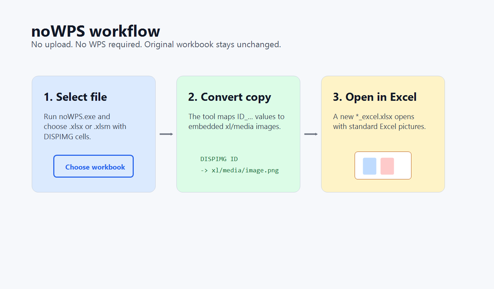

# noWPS

`noWPS` converts WPS Office spreadsheet pictures stored through `DISPIMG` into normal Excel pictures.

Russian documentation: [README.ru.md](README.ru.md)

If Microsoft Excel shows text like this instead of images:

```text
=@_xlfn.DISPIMG("ID_6103C1C6BD2E4DDC8EA68AC2DD3E75C1";1)
=DISPIMG("ID_6103C1C6BD2E4DDC8EA68AC2DD3E75C1",1)
```

then this tool is for that case.

WPS Office can save images inside `.xlsx` files using a WPS-specific extension: `xl/cellimages.xml` plus files in `xl/media/`. Microsoft Excel does not understand this `DISPIMG` extension, so it shows `_xlfn.DISPIMG` or formula text. `noWPS` rewrites the workbook copy and adds standard OpenXML drawing parts, so regular Excel can display the embedded pictures.


## What It Does

- Reads `.xlsx` and `.xlsm` files created or edited in WPS Office.
- Finds cells containing `DISPIMG("ID_...", 1)` or `_xlfn.DISPIMG(...)`.
- Reads WPS image mapping from `xl/cellimages.xml`.
- Reuses images already embedded in the workbook under `xl/media/`.
- Adds normal Excel-compatible `xl/drawings/*` parts.
- Clears the unsupported `DISPIMG` formulas from converted cells.
- Keeps image proportions, so thumbnails are not stretched or flattened.
- Creates a new file next to the original, for example `products.xlsx` -> `products_excel.xlsx`.

The original workbook is not modified.

## Download

For end users, use the ready-made executable:

```text
dist/noWPS.exe
```

No installation is required.

## How To Use

1. Run `noWPS.exe`.
2. Select one or more `.xlsx` or `.xlsm` files in the standard Windows file picker.
3. Wait for the confirmation window.
4. Open the new `_excel.xlsx` file in Microsoft Excel.

You can also run it from Command Prompt or PowerShell:

```powershell
.\noWPS.exe "C:\path\to\file.xlsx"
```

Multiple files are supported:

```powershell
.\noWPS.exe "C:\orders\one.xlsx" "C:\orders\two.xlsx"
```

## Screenshots

Typical problem in Excel:


After conversion:


Workflow:



## Search Keywords

This project is meant for people searching for:

- Excel shows `_xlfn.DISPIMG`
- Excel shows `=@_xlfn.DISPIMG("ID_...",1)`
- Excel shows `=DISPIMG("ID_...",1)` instead of image
- WPS images not visible in Microsoft Excel
- WPS Office pictures missing in Excel
- WPS `cellimages.xml`
- Convert WPS DISPIMG images to Excel
- Open WPS spreadsheet images in Excel
- Images visible in WPS but not in Excel

## Limitations

- `noWPS` does not download images from the internet. It only uses images already embedded inside the workbook.
- It does not patch Microsoft Excel or install an Excel add-in.
- It does not reproduce WPS double-click image preview behavior. Excel receives normal inserted pictures.
- Password-protected or corrupted workbooks are not supported.
- `.xls` binary workbooks are not supported. Save them as `.xlsx` first.

## Privacy

The program runs locally. It does not use the network, does not upload files, and does not require WPS Office.

## Antivirus False Positives

`noWPS.exe` is a small unsigned Windows executable, so some antivirus engines may flag it with generic machine-learning labels such as `susgen`, `ml.score`, or `malicious.moderate`. The source code is included in `src/noWPS.cs`, and the build script is included in `scripts/build.ps1`.

If your organization is strict about unsigned executables, build the EXE from source or sign it with your own code-signing certificate.

## Build From Source

Requirements:

- Windows
- .NET Framework 4.x compiler, usually already present at:

```text
C:\Windows\Microsoft.NET\Framework64\v4.0.30319\csc.exe
```

Build:

```powershell
Set-ExecutionPolicy -Scope Process Bypass
.\scripts\build.ps1
```

The compiled file will be created at:

```text
dist\noWPS.exe
```

## Repository Layout

```text
dist/noWPS.exe              Ready-to-use Windows executable
src/noWPS.cs                Main source code
src/noWPS.exe.manifest      Windows manifest, asInvoker
scripts/build.ps1           Local build script
docs/TECHNICAL.md           How WPS DISPIMG works internally
docs/VIRUSTOTAL.md          Notes about false positives
docs/screenshots/           README images
```

## License

MIT License. See [LICENSE](LICENSE).
