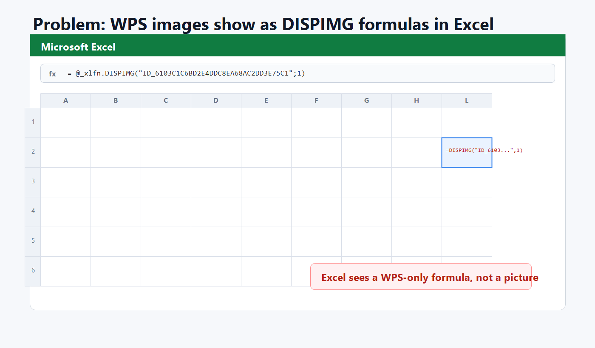
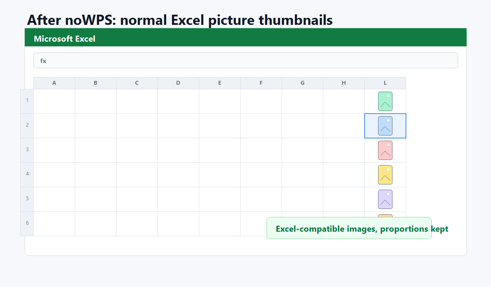

# noWPS

`noWPS` конвертирует картинки из WPS Office, которые хранятся через `DISPIMG`, в обычные картинки Microsoft Excel.

Если в WPS фотографии видны, а в обычном Excel вместо них отображается текст или формула:

```text
=@_xlfn.DISPIMG("ID_6103C1C6BD2E4DDC8EA68AC2DD3E75C1";1)
=DISPIMG("ID_6103C1C6BD2E4DDC8EA68AC2DD3E75C1",1)
```

то это именно та проблема, для которой сделана программа.

WPS кладёт сами изображения внутрь XLSX-файла, но связывает их с ячейками своим нестандартным способом через `xl/cellimages.xml`. Microsoft Excel этот механизм не понимает и показывает `_xlfn.DISPIMG`. `noWPS` создаёт копию книги и добавляет в неё стандартные Excel-картинки.




## Что делает программа

- Открывает `.xlsx` и `.xlsm`.
- Находит ячейки с `DISPIMG("ID_...", 1)` или `_xlfn.DISPIMG(...)`.
- Читает WPS-каталог картинок `xl/cellimages.xml`.
- Берёт изображения, которые уже лежат внутри книги в `xl/media/`.
- Добавляет обычные Excel-совместимые DrawingML-картинки.
- Убирает неподдерживаемые формулы `DISPIMG` из ячеек.
- Сохраняет пропорции изображений, чтобы превью не были сплющены.
- Создаёт новый файл рядом с исходным: `file.xlsx` -> `file_excel.xlsx`.

Оригинальный файл не изменяется.

## Как пользоваться

1. Запустите `noWPS.exe`.
2. Выберите один или несколько `.xlsx` или `.xlsm` файлов.
3. Дождитесь окна “готово”.
4. Откройте новый файл `_excel.xlsx` в обычном Microsoft Excel.

Можно запускать и из PowerShell:

```powershell
.\noWPS.exe "C:\path\to\file.xlsx"
```

## Что отправлять пользователям

Обычным пользователям нужен только:

```text
dist/noWPS.exe
```

Если антивирус или VirusTotal ругается на маленький unsigned EXE, можно дополнительно отправить исходник:

```text
src/noWPS.cs
scripts/build.ps1
```

## Ограничения

- Программа не скачивает картинки из интернета. Она работает только с картинками, уже встроенными в XLSX.
- Программа не ставит надстройки в Excel и не патчит Excel.
- Двойной клик “как в WPS” без макросов в обычном Excel повторить нельзя. Excel получает обычные вставленные картинки.
- Старый `.xls` не поддерживается. Сначала сохраните файл как `.xlsx`.
- Запароленные или повреждённые книги не поддерживаются.

## Безопасность

`noWPS` работает локально, не использует сеть, не требует прав администратора и не устанавливает файлы в систему.

EXE маленький и не подписан сертификатом, поэтому некоторые антивирусы могут показывать эвристические срабатывания вроде `susgen`, `ml.score`, `malicious.moderate`. Исходник включён в репозиторий, программу можно собрать самостоятельно.

## Сборка из исходника

Нужна Windows и стандартный компилятор .NET Framework 4.x:

```text
C:\Windows\Microsoft.NET\Framework64\v4.0.30319\csc.exe
```

Сборка:

```powershell
Set-ExecutionPolicy -Scope Process Bypass
.\scripts\build.ps1
```

Готовый EXE появится здесь:

```text
dist\noWPS.exe
```

## Поисковые запросы

Репозиторий специально содержит фразы, по которым обычно ищут эту проблему:

- Excel показывает `_xlfn.DISPIMG`
- Excel показывает `=DISPIMG("ID_...",1)` вместо фото
- в WPS картинки видны, в Excel нет
- WPS Office картинки не открываются в Excel
- WPS `cellimages.xml`
- конвертировать WPS DISPIMG в Excel
- WPS фото в Excel

## Лицензия

MIT License. См. [LICENSE](LICENSE).
